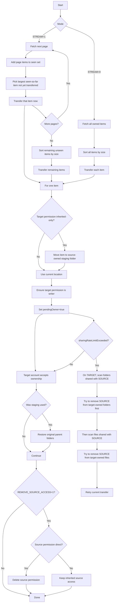

# Google Drive Ownership Transfer


Transfer Google Drive file and folder ownership from one personal Google account to another, with a practical workaround for a painful edge case in the Drive API.

**Why this exists**
This project solves the annoying part of consumer Google Drive ownership transfer when items already inherit access from a parent folder owned by the target account. In that situation, Drive may refuse `pendingOwner` with `pendingOwnerWriterRequired` even though the target appears to be a writer. This tool detects that case, temporarily stages the item, completes the ownership transfer, and restores the original parent structure.

**What it does**
- Transfers ownership from `SOURCE_EMAIL` to `TARGET_EMAIL`
- Works for files and folders
- Supports a fast stream mode
- Optionally removes direct source access after transfer
- Includes a one-file smoke test before a full run

**Transfer logic**


Short version:
- In normal mode, the script fetches everything first and transfers in global size order.
- In stream mode, after each new page it transfers the largest item seen so far, then after pagination ends it transfers the remaining items in global size order.
- If the target account only has inherited access, the script temporarily moves the item into a staging folder so Drive will allow `pendingOwner`.
- After the target accepts ownership, the script restores the original parent folders.
- If `REMOVE_SOURCE_ACCESS=1`, the script removes direct source access when possible. Inherited access on parent folders cannot be deleted at file level.
- If Google returns `sharingRateLimitExceeded`, the script switches to cleanup mode on the target account: it scans folders shared with the source first, then files, removes direct source access where possible, and retries the blocked item.
- Transient DNS, SSL, timeout, and retryable Google API errors are retried automatically. If a run is interrupted and stream mode still has an already-transferred item in memory, the script checks current ownership and skips it.

**Before you run**
1. In Google Cloud Console, create or select a project.
2. Enable the Google Drive API.
3. Go to `APIs & Services -> OAuth consent screen` and configure it.
4. Go to `APIs & Services -> Credentials`.
5. Create an OAuth client of type `Desktop app` for the source account flow and save it as `credentials/client_secret_source.json`.
6. Create another `Desktop app` OAuth client for the target account flow and save it as `credentials/client_secret_target.json`.
7. Copy `.env.example` to `.env` and fill in the account emails.

**.env**
```dotenv
SOURCE_EMAIL=your-source@gmail.com
TARGET_EMAIL=your-target@gmail.com
REMOVE_SOURCE_ACCESS=0
STREAM=0
```

`SOURCE_EMAIL`: current owner account.

`TARGET_EMAIL`: new owner account.

`REMOVE_SOURCE_ACCESS`: `1` removes direct source access after transfer when possible. If source access is inherited from a parent folder, Google Drive will keep that inherited access.

`STREAM`: `1` starts transferring during pagination. After each fetched page the script transfers the largest item seen so far, then finishes all remaining items in global size order after pagination ends.

**Install**
```bash
python3 -m venv .venv
./.venv/bin/pip install -r requirements.txt
cp .env.example .env
```

**Smoke test**
Use this first to validate OAuth, permissions, and acceptance flow on one file:

```bash
./.venv/bin/python test_connection.py
```

The script authenticates the source account, lists the latest 10 files, initiates transfer for the newest file, and if `credentials/client_secret_target.json` exists, accepts the transfer automatically with the target account.

**Full run**
```bash
./.venv/bin/python transfer_all.py
```

**License**
`0BSD` (BSD Zero Clause). Use it for any purpose without attribution requirements.
